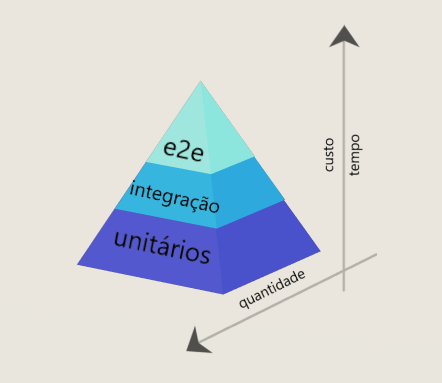

# Curso - Pirâmide de Testes na Prática Explorando Jest e TDD
## Testes unitários
- Pirâmide de testes
    - 
    - Quanto maior o tempo de execução, maior o custo do teste e menos testes daquele tipo serão feitos
- Testes unitários
    - São os mais simples, testam apenas uma funcionalidade específica de uma classe ou módulo
    - São os mais rápidos e os mais usados em quantidade
    - Necessita de mocks para isolar as funcionalidades e torná-las testáveis
        - Mocks - elementos que simulam as implementações reais para permitir ou facilitar os testes
    - O teste unitário do MessageController já existe
    - implementaremos os testes unitários do UserRepository no arquivo *UserRepository.test.ts*:
        ```typescript
        import getEntityManagerMock from '../__mocks__/getEntityManagerMock'
        import { UserRepository } from './UserRepository'
        import { v4 as uuid } from 'uuid'
        import { User } from '../entities/User'

        describe('UserRepository', () => {
            const newId = uuid() 
            const mockUser: User = {
                user_id: newId,
                name: "Pitossomo",
                email: "pitossomos@hmail.ex"
            }

            it('return the saved user when save function is called', async () => {
                const managerMock = await getEntityManagerMock({ saveReturn: mockUser})
                const userRepository = new UserRepository(managerMock)

                const savedUser = await userRepository.save(mockUser)
                expect(savedUser).toMatchObject({
                user_id: newId,
                name: "Pitossomo",
                email: "pitossomos@hmail.ex"
                })
            })
        })
        ```
    - Implementaremos também os testes unitários do UserService no *UserService.test.ts*:
        ```typescript
        import { getMockUser } from '../__mocks__/mockUser'
        import { UserService } from './UserService'

        jest.mock('../repositories/UserRepository')
        const mockUserRepository = require('../repositories/UserRepository')

        describe('UserService', () => {
            const mockUser = getMockUser()

            const userService = new UserService({
                userRepository: mockUserRepository,
                name: "Pitossomo",
                email: "pitossomos@hmail.ex"
            })

            it('returns the user when saved', async () => {
                mockUserRepository.save = jest.fn().mockImplementation(() => {
                    return Promise.resolve(mockUser)
                })
                const savedUser = await userService.createUser()
                expect(savedUser).toHaveProperty("user_id")
                expect(savedUser).toMatchObject({
                name: "Pitossomo",
                email: "pitossomos@hmail.ex"
                })
            })
        })
        ```
    - Podemos observar que o mockUser chama uma função externa, que poderá se reaproveitada nos testes do repositório e nos demais, e está definida no arquivo *src/\_\_mocks__/mockUser.ts*:
    ```typescript
    import { User } from "../entities/User";
    import { v4 as uuid } from 'uuid'

    export const getMockUser = (): User => ({
        user_id: uuid(),
        name: "Pitossomo",
        email: "pitossomo@hmail.ex"
    })
    ```

-------

# TwiDIO API

#### API desenvolvida para o projeto TwiDIO

### Arquitetura

#### 📂Controllers
> Aplica validações necessárias na requisição.
#### 📂Services
> Aplica regras de negócios antes de enviar ao repositório.
#### 📂Repositories
> Salva os dados no banco de dados.
#### 📂Entities
> Gerencia a estrutura das entidades da aplicação.
#### 📂Database
> Cria as conexões necessárias com o banco de dados.

#### 📂__mocks __
> Armazena os dados e mocks utilizados nos testes unitários.
#### 📂tests
> Armazena as switch de testes de integração.

```
 📁 TwiDIO
   |
   |-  📁 src
   |    |
   |    |- 📁 __mocks_
   |         |- 📄 getEntityManagerMock.ts
   |         |- 📄 mockContentList.ts
   |         |- 📄 mockRequest.ts
   |         |- 📄 mockResponse.ts
   |
   |    |- 📁 database
   |         |- 📁 migrations
   |         |- 📄 index.ts
   |         |- 📄 database.sqlite
   |         |- 📄 database.test.sqlite
   |
   |    |- 📁 controllers
   |         |- 📄 UserController.ts
   |         |- 📄 MessageController.ts
   |
   |    |- 📁 entities
   |         |- 📄 User.ts
   |
   |    |- 📁 repositories
   |         |- 📄 UserRepository.ts
   |
   |    |- 📁 services
   |         |- 📄 UserService.ts
   |
   |    |- 📁 tests
   |         |- 📄 message.test.ts
   |         |- 📄 user.test.ts
   |
   |
   |- 📄 .gitignore
   |- 📄 package.json
   |- 📄 app.ts
   |- 📄 index.ts
   |- 📄 router.ts

```

### Este projeto usa
- Node
- Typescript
- Jest
- SQLite
- TypeORM

### Como rodar o projeto

1 - Clone o repositório

2 - Instale todas as dependências

---
    yarn install
---

4 - Acesse a rota principal

<http://localhost:5000/v1/>

### Testando o projeto

#### Testes unitários

---
    yarn test:unit
---

#### Testes de integração

1 - Rode a aplicação em modo de desenvolvimento

---
    yarn run dev
---

1 - Rode os testes de integração no repositório /tests

---
    yarn test:integration
---

### endpoints

**_GET_** /

Retorna uma mensagem de boas vindas

##### Exemplo

---
    http://localhost:5000/
---

**_POST_** /user 

Cria um novo usuário no banco de dados. Todos os campos são obrigatórios

##### Exemplo

---
    body {
        email: 'author@email.com',
        name: 'Nome do usuário'
    }
---

**Desafios sugeridos**

- Usando os conceitos de TDD

[ ] Implementar uma rota que retorne todos os usuários cadastrados

[ ] Implementar uma mensagem de erro quando tentar cadastrar um usuário com os campos em branco

### Happy hacking!

