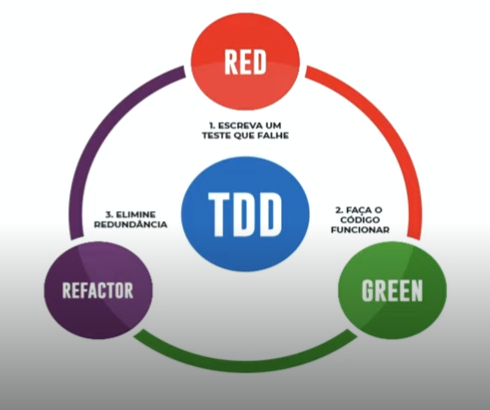

# Curso - Pirâmide de Testes na Prática Explorando Jest e TDD
## Testes unitários
### Pirâmide de testes
- 
- Quanto maior o tempo de execução, maior o custo do teste e menos testes daquele tipo serão feitos
### Testes unitários
- São os mais simples, testam apenas uma funcionalidade específica de uma classe ou módulo
- São os mais rápidos e os mais usados em quantidade
- Necessita de mocks para isolar as funcionalidades e torná-las testáveis
    - Mocks - elementos que simulam as implementações reais para permitir ou facilitar os testes
- O teste unitário do MessageController já existe
- implementaremos os testes unitários do UserRepository no arquivo *UserRepository.test.ts*:
    ```typescript
    import getEntityManagerMock from '../__mocks__/getEntityManagerMock'
    import { UserRepository } from './UserRepository'
    import { v4 as uuid } from 'uuid'
    import { User } from '../entities/User'

    describe('UserRepository', () => {
        const newId = uuid() 
        const mockUser: User = {
            user_id: newId,
            name: "Pitossomo",
            email: "pitossomos@hmail.ex"
        }

        it('return the saved user when save function is called', async () => {
            const managerMock = await getEntityManagerMock({ saveReturn: mockUser})
            const userRepository = new UserRepository(managerMock)

            const savedUser = await userRepository.save(mockUser)
            expect(savedUser).toMatchObject({
            user_id: newId,
            name: "Pitossomo",
            email: "pitossomos@hmail.ex"
            })
        })
    })
    ```
- Implementaremos também os testes unitários do UserService no *UserService.test.ts*:
    ```typescript
    import { getMockUser } from '../__mocks__/mockUser'
    import { UserService } from './UserService'

    jest.mock('../repositories/UserRepository')
    const mockUserRepository = require('../repositories/UserRepository')

    describe('UserService', () => {
        const mockUser = getMockUser()

        const userService = new UserService({
            userRepository: mockUserRepository,
            name: "Pitossomo",
            email: "pitossomos@hmail.ex"
        })

        it('returns the user when saved', async () => {
            mockUserRepository.save = jest.fn().mockImplementation(() => {
                return Promise.resolve(mockUser)
            })
            const savedUser = await userService.createUser()
            expect(savedUser).toHaveProperty("user_id")
            expect(savedUser).toMatchObject({
                name: "Pitossomo",
                email: "pitossomos@hmail.ex"
            })
        })
    })
    ```
- Podemos observar que o mockUser chama uma função externa, que poderá se reaproveitada nos testes do repositório e nos demais, e está definida no arquivo *src/\_\_mocks__/mockUser.ts*:
    ```typescript
    import { User } from "../entities/User";
    import { v4 as uuid } from 'uuid'

    export const getMockUser = (): User => ({
        user_id: uuid(),
        name: "Pitossomo",
        email: "pitossomo@hmail.ex"
    })
    ```
- Criaremos mais testes unitários, desta vez para para o UserController no arquivo *UserController.test.ts*:
    ```typescript
    import { makeMockRequest } from '../__mocks__/mockRequest'
    import { makeMockResponse } from '../__mocks__/mockResponse'
    import { UserController } from './UserController'
    import { getMockUser } from '../__mocks__/mockUser' 
    import { User } from '../entities/User'

    const mockUser: User = getMockUser()

    jest.mock('../services/UserService', () => {
        return { UserService: jest.fn().mockImplementation(() => {
            return { 
            createUser: jest.fn().mockImplementation(() => Promise.resolve(mockUser))
            }
        })}
    })

    describe('UserController', () => {
    const userController = new UserController()
    
        it('must return status 201 and the saved user', async () => {
            const request = makeMockRequest({
            body: {
                name: "Pitossomo",
                email: "pitossomos@hmail.ex"
            }
            })
            const response = makeMockResponse()

            await userController.createUser(request, response)
            
            expect(response.state.status).toBe(201)
            expect(response.state.json).toHaveProperty("user_id")
            expect(response.state.json).toMatchObject({
                name: "Pitossomo",
                email: "pitossomos@hmail.ex"
            })
        })
    })
    ```
## Test Driven Development - TDD

- A filosofia do *Test Driven Development*, ou TDD para os íntimos, é escrever primeiro o teste e a partir daí criar o código que faça aquele teste funcionar
- Suas etapas são:
    - Escrever o teste (que irá falhar)
    - Escrever o código (que fará o teste ter sucesso)
    - Refatorar para eliminar ineficiências e reduncâncias (sem deixar o teste falharo sucesso do código)
- Como exemplo, podemos adicionar um teste do UserController para garantir que retorne código 400 quando as propriedades `name` e `email` forem strings vazias:
    ```typescript
    it('must return status 400 when name or email are empty', async () => {
        const request = makeMockRequest({
            body: {
                name: '',
                email: ''
            }
        })
        const response = makeMockResponse()

        await userController.createUser(request, response)
        expect(response.state.status).toBe(400)
    })
    ```
- Inicialmente, o teste irá falhar caso não haja a validação, portanto devemos implementá-la:
    ```typescript
    export class UserController {
        async createUser (request: Request, response: Response): Promise<Response> {
            const { name, email } = request.body

            // Validação
            if(name.length < 1 || email.length < 1) {
                return response.status(400).json({})
            }
            const userService = new UserService({ name, email })

            try {
                const newUser = await userService.createUser()
                return response.status(201).json(newUser)
            } catch (error) {
                console.log(error)
                return response.status(500)
            }
        }
    }
    ```
-------

# TwiDIO API

#### API desenvolvida para o projeto TwiDIO

### Arquitetura

#### 📂Controllers
> Aplica validações necessárias na requisição.
#### 📂Services
> Aplica regras de negócios antes de enviar ao repositório.
#### 📂Repositories
> Salva os dados no banco de dados.
#### 📂Entities
> Gerencia a estrutura das entidades da aplicação.
#### 📂Database
> Cria as conexões necessárias com o banco de dados.

#### 📂__mocks __
> Armazena os dados e mocks utilizados nos testes unitários.
#### 📂tests
> Armazena as switch de testes de integração.

```
 📁 TwiDIO
   |
   |-  📁 src
   |    |
   |    |- 📁 __mocks_
   |         |- 📄 getEntityManagerMock.ts
   |         |- 📄 mockContentList.ts
   |         |- 📄 mockRequest.ts
   |         |- 📄 mockResponse.ts
   |
   |    |- 📁 database
   |         |- 📁 migrations
   |         |- 📄 index.ts
   |         |- 📄 database.sqlite
   |         |- 📄 database.test.sqlite
   |
   |    |- 📁 controllers
   |         |- 📄 UserController.ts
   |         |- 📄 MessageController.ts
   |
   |    |- 📁 entities
   |         |- 📄 User.ts
   |
   |    |- 📁 repositories
   |         |- 📄 UserRepository.ts
   |
   |    |- 📁 services
   |         |- 📄 UserService.ts
   |
   |    |- 📁 tests
   |         |- 📄 message.test.ts
   |         |- 📄 user.test.ts
   |
   |
   |- 📄 .gitignore
   |- 📄 package.json
   |- 📄 app.ts
   |- 📄 index.ts
   |- 📄 router.ts

```

### Este projeto usa
- Node
- Typescript
- Jest
- SQLite
- TypeORM

### Como rodar o projeto

1 - Clone o repositório

2 - Instale todas as dependências

---
    yarn install
---

4 - Acesse a rota principal

<http://localhost:5000/v1/>

### Testando o projeto

#### Testes unitários

---
    yarn test:unit
---

#### Testes de integração

1 - Rode a aplicação em modo de desenvolvimento

---
    yarn run dev
---

1 - Rode os testes de integração no repositório /tests

---
    yarn test:integration
---

### endpoints

**_GET_** /

Retorna uma mensagem de boas vindas

##### Exemplo

---
    http://localhost:5000/
---

**_POST_** /user 

Cria um novo usuário no banco de dados. Todos os campos são obrigatórios

##### Exemplo

---
    body {
        email: 'author@email.com',
        name: 'Nome do usuário'
    }
---

**Desafios sugeridos**

- Usando os conceitos de TDD

[ ] Implementar uma rota que retorne todos os usuários cadastrados

[ ] Implementar uma mensagem de erro quando tentar cadastrar um usuário com os campos em branco

### Happy hacking!

